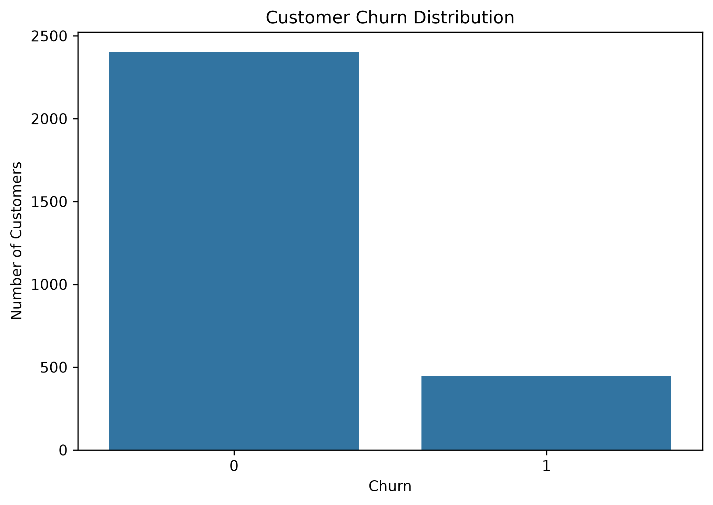
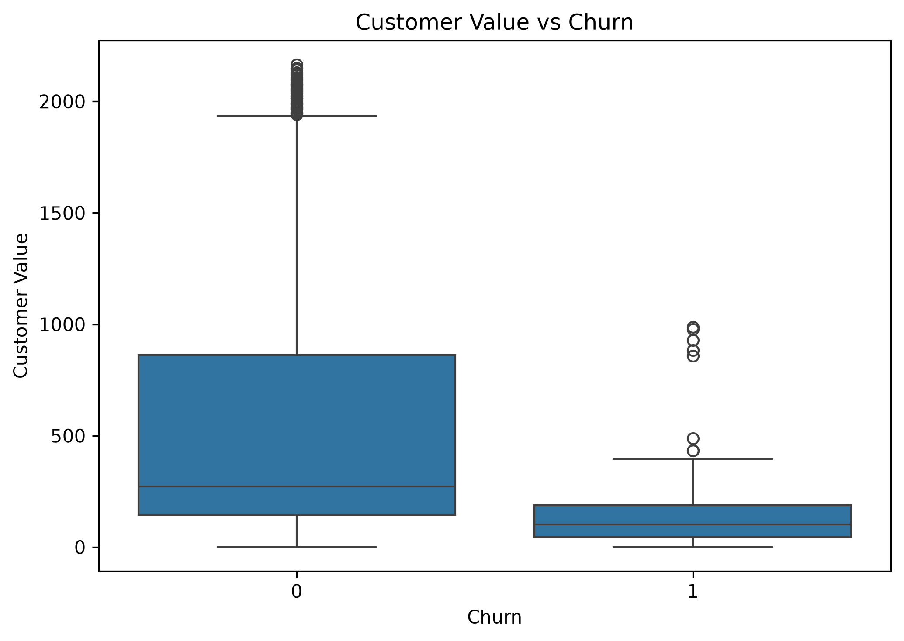
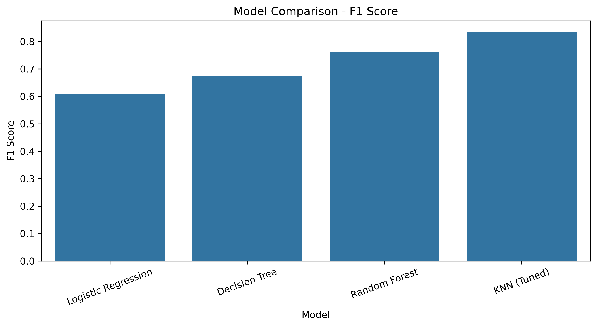

# Customer Churn Analysis & Prediction

An end-to-end data analysis and machine learning project to identify customer churn patterns and predict customers who may be at higher risk of churn.

## Project Overview

Customer churn is an important business problem for telecom companies because identifying customers who may leave can help support customer retention efforts.

This project analyzes customer behavior, usage, service-related characteristics, and customer value to understand patterns associated with churn. Statistical analysis and machine learning models were then used to evaluate the predictive potential of the available customer data.

## Project Highlights

- Analyzed 3,150 customer records and cleaned the dataset to 2,850 records.
- Performed exploratory and statistical analysis to identify churn-related patterns.
- Built and compared Logistic Regression, Decision Tree, Random Forest, and tuned KNN models.
- Tuned KNN achieved an F1 score of 83.43% and recall of 82.02% on the held-out test set.
- Identified customer complaints, engagement levels, and customer value as important churn-related factors.
- Created visualizations and business-focused insights to support customer retention analysis.

## Key Visualizations

### Churn Distribution

### Customer Value vs Churn

### Model F1 Score Comparison

## Objectives

* Understand customer churn patterns through exploratory data analysis.
* Identify customer characteristics associated with churn.
* Apply statistical tests to support the analysis.
* Prepare customer data for machine learning.
* Compare multiple classification models.
* Evaluate models using accuracy, precision, recall, and F1 score.
* Identify important features associated with the model's predictions.
* Translate analytical findings into business-oriented insights.

## Dataset

The project uses the **Iranian Churn Dataset**, containing telecom customer information and a binary churn indicator.

### Final Dataset

* Initial records: 3,150
* Duplicate records removed: 300
* Final records: 2,850
* Features: 13
* Target variable: `Churn`

The target variable indicates whether a customer churned or remained with the service.

## Technologies & Libraries

* Python
* Jupyter Notebook
* Pandas
* NumPy
* Matplotlib
* Seaborn
* Scikit-learn
* SciPy

## Project Workflow

### 1. Data Understanding

* Dataset shape and structure
* Data types
* Missing-value analysis
* Duplicate detection
* Unique-value analysis
* Target-variable distribution

### 2. Data Cleaning

* Identified and removed duplicate records.
* Checked for missing values.
* Examined categorical and numerical variables.
* Removed `Age Group` from the modeling features because it duplicates information represented by `Age`.

### 3. Exploratory Data Analysis

Analyzed relationships between churn and:

* Customer Value
* Customer usage
* Frequency of use
* Frequency of SMS
* Distinct Called Numbers
* Complaints
* Tariff Plan
* Status
* Age
* Subscription Length

Visualizations included distribution plots, count plots, box plots, and a correlation heatmap.

### 4. Statistical Analysis

Statistical tests were used to investigate associations and differences between churned and non-churned customers.

The analysis included:

* Descriptive statistics
* Mann–Whitney U tests for numerical variables
* Chi-square tests for categorical variables
* Effect-size measures including rank-biserial correlation and Cramér's V

### 5. Machine Learning

The following classification models were evaluated:

* Logistic Regression
* Decision Tree
* Random Forest
* K-Nearest Neighbors (KNN)

Data preprocessing included:

* StandardScaler for numerical features
* OneHotEncoder for categorical features
* Pipeline-based preprocessing and modeling

KNN hyperparameters were evaluated using 5-fold cross-validation based on F1 score.

## Model Evaluation

The models were evaluated using a held-out test set and 5-fold cross-validation.

| Model               | Accuracy | Precision | Recall | F1 Score | Mean CV F1 |
| ------------------- | -------: | --------: | -----: | -------: | ---------: |
| Logistic Regression |   90.35% |    82.69% | 48.31% |   60.99% |     58.03% |
| Decision Tree       |   91.23% |    80.00% | 58.43% |   67.53% |     71.10% |
| Random Forest       |   93.68% |    92.06% | 65.17% |   76.32% |     79.16% |
| KNN (Tuned)         |   94.91% |    84.88% | 82.02% |   83.43% |     83.05% |

For churn identification, recall and F1 score were considered alongside accuracy because correctly identifying customers who actually churned is important for retention-focused analysis.

## Feature Importance

Random Forest feature importance was examined to understand which variables contributed most to the model's predictions.

The analysis showed notable contributions from:

* Complaints
* Status
* Seconds of Use
* Subscription Length
* Frequency of Use
* Distinct Called Numbers
* Customer Value

Feature importance represents contribution to the model's predictions and should not be interpreted as proof of causation.

## Key Business Insights

* Lower customer value was associated with higher observed churn.
* Churned customers showed substantially lower customer engagement and usage.
* Customers who complained had a substantially higher observed churn rate than customers who did not complain.
* Tariff Plan and Status showed different churn patterns across their coded categories.
* The predictive model can serve as a supporting tool for identifying customers who may require retention-focused attention.

## Conclusion

This project demonstrates an end-to-end data analysis workflow, covering data cleaning, exploratory analysis, statistical testing, feature preparation, machine learning, model evaluation, feature importance, and business interpretation.

The tuned KNN model achieved an F1 score of **83.43%** and recall of **82.02%** on the test set, with a mean 5-fold cross-validation F1 score of **83.05%**.

The findings provide a foundation for further validation using additional customer data and real-world business context.

## Limitations

* The analysis is based on a single telecom customer churn dataset.
* Some categorical variables are coded and their exact business meanings are not available.
* Observed associations do not establish causal relationships.
* Model performance should be validated on new, unseen customer data before production use.

